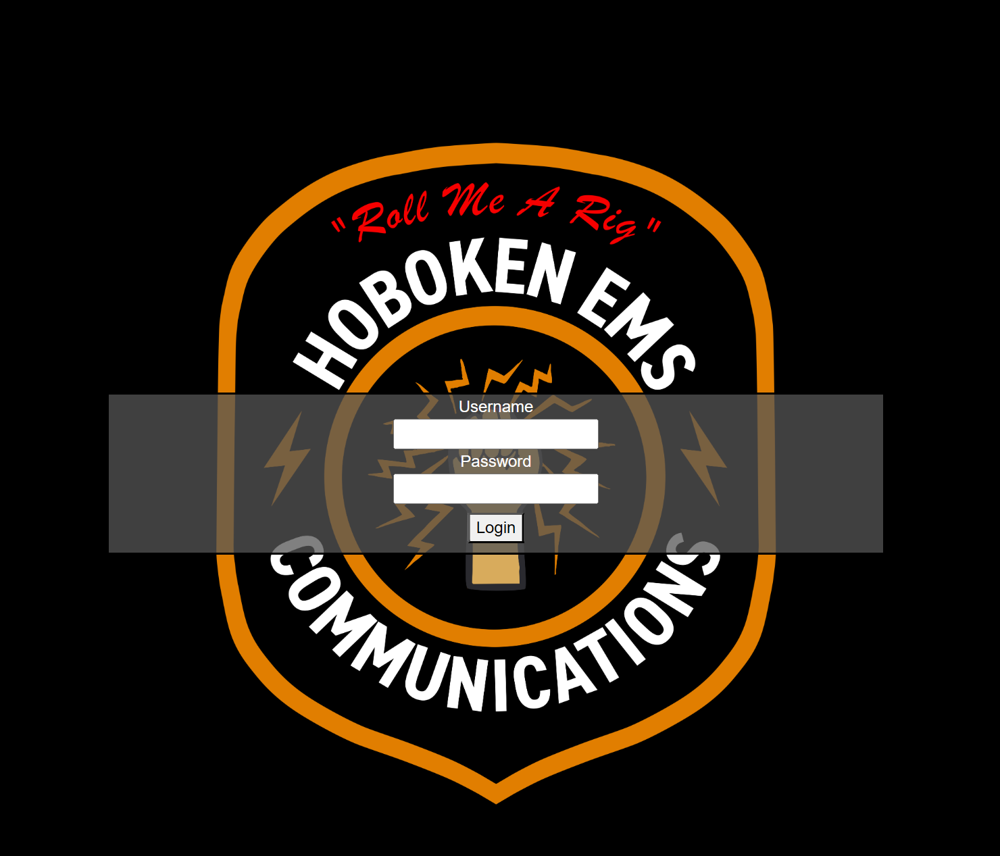

# Hermes
## Abstract
Welcome to Hermes!
This passion project was created for the sole purpose of expanding the capabilities of the Hoboken Volunteer Ambulance Corps. Mostly dispatched by our Police Department, there are days, such as bar crawls and holidays, when the ambulance corps utilizes "FieldComm" for better communication between our units, supervisors, and our own dispatchers.
Hermes expands upon the functionality of the open source-PHP based **[Blackflower CAD](https://github.com/PhirePhly/blackflower)**, giving new options for dispatchers and units alike.

---
For Units:

 - Staffing & Vehicle assignments
 - Incident attach/update notices from an MDT page
 - Ability to change unit status
 - Display board that can be placed into a common area

---
For Dispatchers

- Unit location monitoring
- Ability to sound tones that can be interpreted and transmitted over the air.
- Ability to use an AutoDispatcher

---

